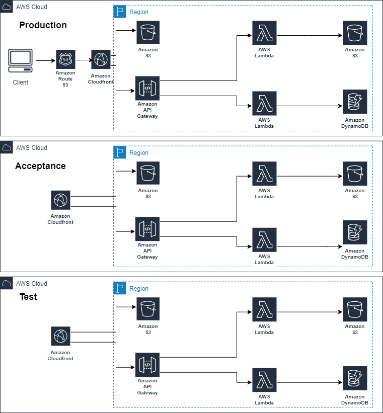

# Sentia Assignment Deliverables 
The purpose of this repository is to provide the deliverables of the assignment related to the cloud systems consultant role.
## Tables of Content
- [Overview](#Overview)
- [Client Requirements](#Client-Requirements)
- [Transformation](#Transformation)
	 - [Current Architecture](#Current-Architecture)
	 - [Assumptions](#Assumptions)
	 - [What Fits the Best?](#What-Fits-the-Best?)
	 - [Decisions](#Decisions)
- [Architectural Design](#Architectural-Design)
	 - [Application Architecture](#Application-Architecture )
	 - [Application Architecture - Networking](#Application-Architecture---Networking)
	 - [Application Architecture - Environments](#Application-Architecture---Environments)
	 	 - [Accounts Architecture](#Accounts-Architecture)
		 - [Environments Architecture](#Environments-Architecture)
	 - [Application Architecture - High Avalability](#Application-Architecture---High-Avalability)
	 - [Application Architecture - Scalability](#Application-Architecture---Scalability)
	 - [Application Architecture - Security](#Application-Architecture---Security)
	 - [Application Architecture - Disaster Recovery Plan](#Application-Architecture---Disaster-Recovery-Plan)
	 - [Application Architecture - Pricing Example](#Application-Architecture---Pricing-Example)
- [AWS Elasticsearch](#AWS-Elasticsearch)
	 - [Elasticsearch - Logs Ingestion](#Elasticsearch---Logs-Ingestion)
	 - [Elasticsearch - Accounts Architecture](#Elasticsearch---Accounts-Architecture)
	 - [Elasticsearch - Architecture](#Elasticsearch---Architecture)
	 - [Elasticsearch - Pricing Example](#Elasticsearch---Pricing-Example)
- [CRON Jobs](#CRON-Jobs)
	 - [AWS Batch](#AWS-Batch)
- [IaC MVP Architecture](#IaC)
- [Time Log & Followed Processes](#Time-Log-&-Followed-Processes)
## Overview
The solution of the assignment is divided between the deliverables in gitub and the presentation.
The deliverables in github will include less detailed information about why I have taken a certain decision or chosen a service/tool/design over another. Instead, this information will be kept for the presentation.

## Client Requirements
General Requirements:
- Scalability
- Flexibility
- Utilization Managed Services
- Cost Optimization

Specific Requirements:
- Environments Isolation
- Logs Collection
- ElasticSearch Private access

## Transformation
In order to reach the best transformation model, we need to identify:
- The client expectations 'Gather as many information as possible'
- The client pain points
### Current Architecture
A web application that consist of NodeJs, MongoDB, FTP,  NGINX Reverse Proxy and Cron Server.  All running on self-managed inhouse VMs.
### Assumptions
- Stateless E-Commerce website with a monthly traffic average of 2 million active users.
- Users can browse and buy the products without login.
- SLA of 99.5%. RTO of 30 minutes and RPO of 30 minutes.
### What Fits the Best?
- Migrating form self-managed services to managed services.
- Serverless Vs EC2?
- Serverless:
	 - Low Cost
	 - Don't pay for idle resources
	 - No infrastructure to manage
	 - Infinitely scalable
- Does Serverless fits for this use case?
	 - Compliance ‘multi-tenancy’
	 - Long term tasks
	 - Cold start
### Decisions
- The application fits to be transformed into serverless application and the cons of lambda limitations won’t affect the application.
- The customer agrees on the transformation to experience the advantages of the serverless approach and this include the migration from MongoDB to DynamoDB, FTP to S3 and from VMs to serverless whenever it is possible.

## Architectural Design
As stated above, the current application architecture is based on a number of self-managed services such as Nginx, MongoDB, FTP and NodeJS running on VMs on-premise in addition to a cron server.

The new architecture leverage serverless approach using AWS public cloud. MongoDB will be migrated to DynamoDB, S3 will be used instead of FTP, NodeJS will run on Lambda functions, the cron jobs will be scheduled using AWS Batch or Lambda & Step functions based on the job type. AWS managed ElasticSearch aka ELK stack will be used for the application and infrastructure logs.

### Application Architecture
The application architecture is divided into three parts: CDN, frontend and backend. The application static content 'frontend' will be hosted in S3 using S3 static website hosting, the application logic 'backend' will be running on Lambda. The application frontend and backend will be delivered globally using CloudFront. Route53 is to be used to configure DNS .

### Application Architecture - Networking 
One of the biggest advantages of leveraging serverless is that we don't need to provision netwrok resources in order to deploy the application infrastructure.

### Application Architecture - Environments
In order to achieve separation between environments , we will deploy each environment in a separate AWS account
#### Accounts Architecture
It's a best practice to implement AWS Landing Zone to set up multi-account AWS environment but for simplicity, I will consider that we have the below architecture implemented with AWS organizations enabled on the ROOT account.

### Environments Architecture

### Application Architecture - High Availability 
All of the AWS services that are in use in this architecture are managed services beside that they're highly available by default meaning that the data is replicated across three data centers (minimum of 2 AZs).
### Application Architecture - Scalability 
By applying minimal configuration and requesting quotas increase, we can scale the application infrastructure to handle any number of requests at any point of time.
### Application Architecture - Security
- By Default, AWS Sheild standard is enabled for AWS services to protect against DDoS attacks and all known infrastructure (Layer 3 and 4) attacks.
- AWS WAF is be used for creating security rules that block common attack patterns, such as SQL injection or cross-site scripting, and rules that filter out specific traffic patterns we define. 
- Turn on AWS Trusted Advisor for real time guidance on security, cost optimization, performance, service limits and fault tolerance.
- Enable Orgin Access Identity on CloudFront.
- Authentication layer to be added using AWS Cognito is recommended but it's not required for this use case.
- Encryption in transit using SSL and at rest using KMS or AWS managed keys.
- Resource Policy to allow access to the permitted entities only.
- Optionally, we can leverage AWS Config and Gaurd Duity for resources configuration compliance check and remediation, and threat detection.
- Enable CloudTrail log file integrity validation. 

### Application Architecture - Disaster Recovery Plan
Based on the business objectives of 99.5% SLA, RPO and RTO of 30 minutes, the disaster recovery plan below will achieve the requirements with minimal costs.
By configuring failover policy on Route53 to failover to the secondary region upon the primary region failure.

### Application Architecture - Pricing Example
- A CloudFront that receives 20 million HTTPS calls per month, with 100GB of data transferred out to the internet, and 50GB from edge locations to origin will cost 22$.
- A Lambda function with 15 million execution, allocated 128MB of memory and it ran for 200ms each time, will cost $5.33.
- A Dynamodb table with 3.5 million writes and 3.5 million reads of 1 KB for on-demand capacity mode with 25GB of storage will cost $5.83. Global table replication and 25GB storage will cost 8.19$. 60GB of on-demand backup will cost 6$. The total will be 20$.
- An API Gateway with 15 million API calls per month, with each API call returning responses of 3 kilobytes (KB) in size with no caching cost will be $56.37
- An S3 bucket/s of 1 million PUT requests, 3 million GET requests, and 1 TB of standard storage will cost 30$ per month. Cross region replication will cost 15$ plus 23$ for 1TB of of standard storage will be 38$. The total will be 68$.
- A web Application Firewall with 1 Web ACL, 10 rules and 20 million requests will cost 21$
- Route 53 alias queries and DNS failover comes at no additional cost.
- The Disaster Recovery Plan will cost 38$ for S3 and 8.19$ for DynamoDB. The total will be 46.19$.
- Encryption comes at no cost when using AWS owned CMK for Dynamodb, and 99% less in cost with leveraging S3 Bucket Keys with SSE-KMS.

**The total monthly cost for running the application will be 201.7$**
## AWS Elasticsearch
Amazon Elasticsearch Service is a fully managed service that makes it easy for you to deploy, secure, and run Elasticsearch cost effectively at scale.

The service provides support for open source Elasticsearch APIs, managed Kibana, integration with Logstash
### Elasticsearch - Accounts Architecture
Note: It's a best practice to have a dedicated AWS account for storing the logs but for simplicity I am considering having the ES cluster in the same account.

A CloudTrail trail configured for management and data events is created in the root account and enabled for all accounts inside the organization.
The trail is configured to store the trails in s3 bucket in Logs & monitoring account and it push the logs to Cloudwatch which has subscription filter enabled to ingest the logs into ES cluster in Logs & monitoring account.

### Elasticsearch - Logs Ingestion
In each account, the application and infrastructure logs is pushed to CloudWatch which has which has subscription filter enabled to ingest the logs into ES cluster in Logs & monitoring account using cross account access.

### Elasticsearch - Architecture
AWS ES is deployed in private subnets with no internet in/out access. 

To meet the requirement of accessing the dashboard from the headquarter only, a site to site VPN is configured to allow access to the Kibana dashboard.

### Elasticsearch - Pricing Example
- Logs Collection:
	 - Five CloudTrail trails is configured to capture management and data events. 500000 events of 50GB stored in S3 will cost 7.15$.
	 - 25GB of VPC flow logs, Route 53 public DNS query logs delivery to Cloudwatch will cost 14.25$
	 - 100GB of data transferred out of Cloudwatch to ES will cost 9$ using subscription filter which is a lambda function that will cost around 5.33$ considering the previous pricing example.

**The total cost for logs collection and ingestion will be 35.73$**

- AWS ElasticSearch:
	 - Consider an ES Cluster with 500GB gp2 volumes, three master nodes of C5.large and four nodes of R5.large on  reserved instances pricing model with no up front will cost **680$**. 414$ (388.8$ all up front)of which is for the data nodes, 211$(132.48$ all up front) for master nodes and 55$ for gp2 volume.

**Note: The size and number of instances, and the need for dedicated master nodes mainly depends on the workload. An AWS ES cluster can start with one small instance.**

## CRON Jobs
Based on the complexity of the CRON job and the required hardware resources to complete the job, the service that can be used to run the job can be determined. 

For small and short running jobs, a combination of AWS Step Functions and Lambda Functions can be scheduled to run the jobs with very low cost.

For more complex and long running jobs, AWS Batch can be leveraged to run these jobs.

### AWS Batch
AWS Batch is a managed service that eliminate the need for a dedicated EC2 instance.

AWS Batch dynamically provisions the optimal quantity and type of compute resources (e.g., CPU or memory optimized instances) based on the volume and specific resource requirements of the batch jobs submitted.

 AWS Batch plans, schedules, and executes the batch computing workloads across the full range of AWS compute services and features, such as AWS Fargate, Amazon EC2 and Spot Instances.

## IaC
In this IaC MVP demo, we will review CloudFormation nested stack and custom resources concept by deploying five child stacks using a parent stack.

**Please note that I have resued an application logic from someone github public repo that can be found [Here](https://github.com/eh3rrera/react-app-frontend "Link")** 

What I have done is that I have written the cloudformation templates to deploy this application using serverless architecture.

The application consist of a single-page application made with React and Redux. 

This application provide an interface to perform CRUD operations against dynamodb tables that represent courses catalog. This is how it looks like:

### Architecture
Each child stack represent a layer of the application design:
- Network ‘for ES cluster’
- Frontend ‘S3 only’
- Backend - logic
- Backend - API
- Backend - database ‘stack policy’

**The Fifth stack build and deploy the application code by using cloudformation custom resource and helper script.**

The network resources aren’t in use. It’s just for demonstration purposes.

## Time Log & Followed Processes
Please Note That:
- The dates aren't 100% accurate.
- The order is accurate. 

START - 08/01

08/01

- Read through the assignment
- Break down the assignment into smaller tasks
- How to stand out from other AWS partners? 
- EC2 vs Serverless? 
- Set assumptions and business objectives

13/01

- Application architecture on paper => Started 13/01
- Draw diagrams  => Started 15/01
- Deliver on github  => Started 18/01
- Presentation  => Started 20/01
- IaC => Started 22/01

END - 28/01 

